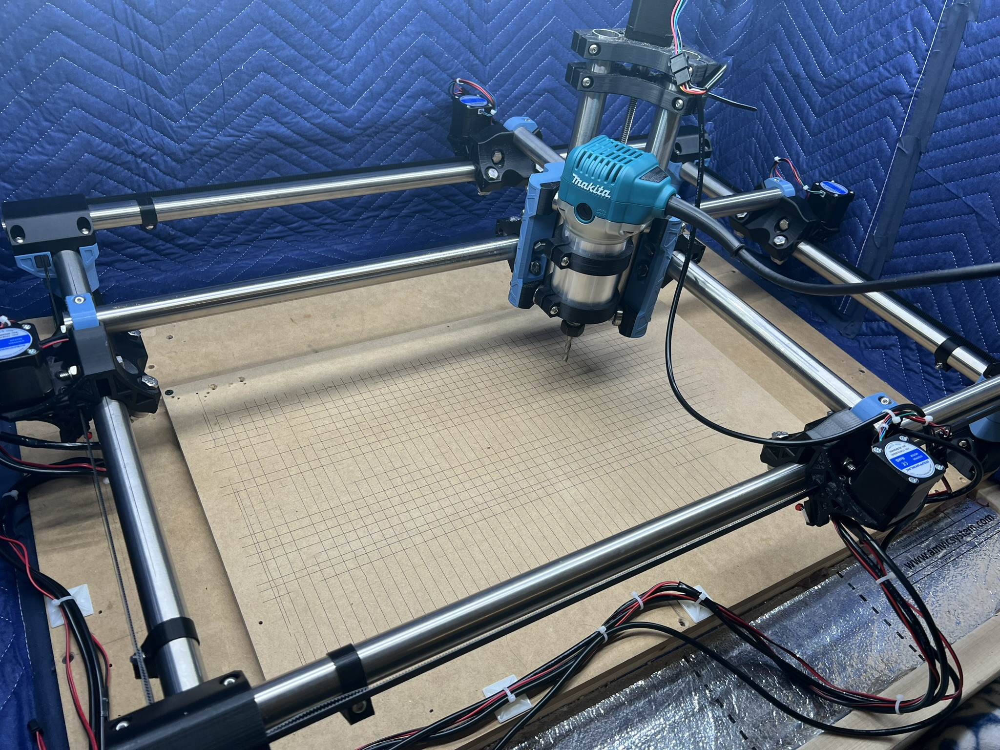
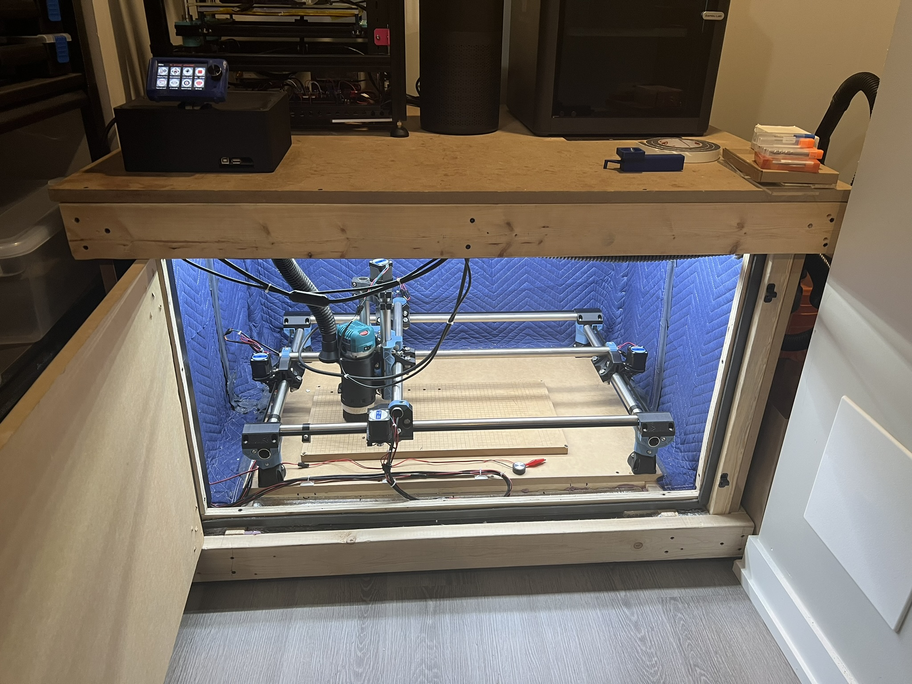

# MPCNC Primo

## Table of Contents
- [Description](#description)
- [Table of Resources](#table-of-resources)
- [BOM](#bom)
- [Bits and Settings](#bits-and-settings)
- [Enclosure/Table](#enclosuretable)
- [Dust Management and Dust Shoe](#dust-management-and-dust-shoe)
- [Electronics](#electronics)
- [Build](#build)

---

## Description
This project is my customized version of the [MPCNC Primo](https://www.v1engineering.com/) by V1 Engineering. Within this repository, you will find:
- My unique accessories and modifications.
- Detailed notes on CNC bits and cutting settings.
- A custom-built enclosure/table designed for noise reduction and easy access.
- An electronics box design for convenient maintenance and future upgrades.

The MPCNC (Mostly Printed CNC) is an open-source CNC platform that combines 3D-printed components, off-the-shelf hardware, and commonly available electronics. By customizing the layout, enclosure, and tooling, I’ve tailored this CNC to meet my personal workflow and workspace needs.

---

## Table of Resources
Below is a table of some resources related to this build, including official documentation and helpful community links. Modify or add more links as needed.

| Resource                                     | Link                                                               |
|----------------------------------------------|--------------------------------------------------------------------|
| V1 Engineering - MPCNC Primo Docs            | [https://www.v1engineering.com/](https://www.v1engineering.com/)   |
| Marlin Firmware Repository                   | [https://github.com/MarlinFirmware/Marlin](https://github.com/MarlinFirmware/Marlin) |
| MPCNC Forum & Community                      | [https://forum.v1engineering.com/](https://forum.v1engineering.com/) |
| Dust Shoe          | [https://grabcad.com/library/mpcnc-primo-dust-shoe-makita-router-1](#)                                                      |
| BTT TFT35 v3 TFT Display Case   | [https://www.thingiverse.com/thing:4338772](#)                                                      |

---

## BOM
Below is the Bill of Materials (BOM) for the MPCNC Primo and the table/enclosure. This includes both the standard hardware from the official MPCNC build, as well as some additional parts I selected for my setup.

| Part                | QTY  | Type           | Link (if applicable)                   |
|---------------------|------|----------------|----------------------------------------|
| Duramic3D PLA+ (Denim Blue & Black) | 2   | Primo Printed Parts | [LINK](https://www.amazon.ca/dp/B08HJ6RML7?ref_=ppx_hzsearch_conn_dt_b_fed_asin_title_3)           |
| M8x40mm             | 44  | Hardware           | [LINK](https://www.amazon.ca/dp/B08595FX34?ref_=ppx_hzsearch_conn_dt_b_fed_asin_title_1&th=1)                         |
| M8 Locknut          | 44    | Hardware        | [LINK](https://www.amazon.ca/dp/B0BMX3CBNL?ref_=ppx_hzsearch_conn_dt_b_fed_asin_title_1&th=1)                          |
| M5x30mm             | 60    | Hardware           | [LINK](https://www.amazon.ca/iexcell-Thread-Stainless-Socket-Button/dp/B0B5LVMKYY?crid=1JUE79T8W5LPE&dib=eyJ2IjoiMSJ9.MXkbuKOtGqpqC6k_r6UZyfmu0YUzVUfunhsBEK6PZf-Ye3xOQ4_K9kUS05C4rNO8gXp2rGGRfamm-IIzEVziFDNemgfica6hKaH1K59sSLJzEQY_cnqmfyPrR48onlwYRnAiXMMsizMYFjyx2W1iEWBUFKGr_rERVYe4WAzKdOFPlIIWkKlXSPubhhEmsDcJcPtbc58m2qOsEEwF5HQNt6flnJK_C7S6_LUYwwWFmh87OLChFIYvQSfeUPnNuypsFPK_rXxZsxkXPxF1KDXR_2DgUIdXp6pf38y5EZ2Rfk-OqW3kYUxTl5bQm12rsyE4XdFF9g-FZjaXhJDetV9-sfFzxHc5fMD8HbVdnUYIono.dOzl6IfsOSFcXvg-gbaQQ4SebUP3UzzZLvoMUVifqs4&dib_tag=se&keywords=m5+30mm&qid=1742765341&s=industrial&sprefix=m5+30mm%2Cindustrial%2C86&sr=1-13)                          |
| M5 Locknut          | 60    | Hardware        | [LINK](https://www.amazon.ca/dp/B078NNFT93?ref_=ppx_hzsearch_conn_dt_b_fed_asin_title_4&th=1)                          |
| M3x10mm             | 22    | Hardware           | [LINK](https://www.amazon.ca/iExcell-Stainless-Socket-Button-Included/dp/B08H2HSPQD?crid=3RBI0Q87MJ7DR&dib=eyJ2IjoiMSJ9.DclXWH_rt2hZe-K-GYadFpMZiz_USX8g3ZTWwYVXm4O1NTf8fIu4K_gJgLWGAaFjhgub5mgLT69D58H_kPOZtQjfVLWf2-n3nsHjw_rslBea81FoEQVvkhtP9CNBN7deS5AGf9YTQaTafRIReFun1vWRJ6v1RwKxRBnxjFDN0RKr7xAda-7hH9g1JpOIYzC16n7G4WU2m6f0SyXrSrNPZEIdvjWAPVdvR3pj0TA-hs4FJPgZOiA1vf7CcE_DEBzb9-znaZDNzbKybjjlxbfn3BIihq4yrGCDKh_Avp-LGXHMwbFk5P51NNSPdr81A5Qks0_k9Tz9VdzEA6vEVQ8ilN9oGvdtee1mv5m1dTPtc8I8bI-TSze31zLRtLMBbUnpfztEes37XlAygjelVc1tWkufzxpLJnY5MnBgwpsQSC0-txiYn-2Dbrq8QsC5PRVH.twRhiUzUgyrQ5KdK0tcuwWh4K3mZoQPD3rkCTNbedzs&dib_tag=se&keywords=m3%2B10mm&qid=1742764761&sprefix=m3%2B10mm%2Caps%2C102&sr=8-7&th=1)                          |
| M2.5x12mm           | 8    | Hardware           | [LINK](https://www.amazon.ca/iexcell-Thread-Socket-Screws-Finish/dp/B0DDXR7YN7?crid=1XS0LDUVAYH5Y&dib=eyJ2IjoiMSJ9.5l_nvOfVTEQicl0ehfN17hFDmPl35rh2Y8pDGGyGXTW136eHJogYLM5-kVmNQEv7-ZWZsJTEHa7QQn6nVbfmgpPJQgb5ReqjjdoP-JG3lPWiXweonvOowhO8055HViKp3aNw2LSe7syiQGmYrMrOBAR4MvbTct1ydVyE6uuf7gS5raeRzyVUFVKSmNbtA4rD-UVdb9jei2vZ7gc__L8RerhCXhhwEe4T7pMnF_imPYcAE2Rnl_gHGl2Wyd0yhD0JCTt2-dy96GFuZRRzvhht6vdhit3c21ooJjhRc4_akadZw3N2GNz5ZlKFr1BWTuNsm7G1WnzBzx4Ifd5JmpEGsBB3nNAHj-cJv_hob2VYf8TueUc_Gfe9lkv8KmZKJ50539-fl2Ab-Nws_wXnRbO_aJgsMWtd8a_UOewErrV8R57qJAMaXf22MZi1p8impULq.uFxeBzuYXaSstPZRQynQ7OWGRgOK5BhVbwGwGIOYNFk&dib_tag=se&keywords=M2.5%2B12mm&qid=1742764793&sprefix=m2%2B5%2B12mm%2Caps%2C95&sr=8-1&th=1)                          |
| NEMA 17 50 oz/in+   | 5    | Electronic  | [LINK](https://www.amazon.ca/dp/B00QEYADRQ?ref_=ppx_hzsearch_conn_dt_b_fed_asin_title_1)                          |
| Belt GT2 10mm       | 1    | Hardware           | [LINK](https://www.amazon.ca/dp/B0BYVF35PV?ref_=ppx_hzsearch_conn_dt_b_fed_asin_title_2&th=1)                          |
| Pulley 16T GT2 10mm (5mm bore) | 4 | Hardware | [LINK](https://www.amazon.ca/dp/B0CD7Y5R7Y?ref_=ppx_hzsearch_conn_dt_b_fed_asin_title_1&th=1)                          |
| Idler 20T GT2 10mm (5mm bore)  | 8 | Hardware  | [LINK](https://www.amazon.ca/dp/B07P7CF1SZ?ref_=ppx_hzsearch_conn_dt_b_fed_asin_title_2)                          |
| 24V Power Supply (PSU)  | 1   | Electronic | [LINK](https://www.amazon.ca/dp/B07TTRY6XF?ref_=ppx_hzsearch_conn_dt_b_fed_asin_title_5&th=1)        |
| Power Supply Fuse  | 1   | Electronic | [LINK](https://www.amazon.ca/dp/B07Y8DBF7T?ref_=ppx_hzod_title_dt_b_fed_asin_title_0_1)        |
| 4-Strand Wires      | 1    | Electronic         | [LINK](https://www.amazon.ca/dp/B0CLRLJW9K?ref_=ppx_hzsearch_conn_dt_b_fed_asin_title_10&th=1)                          |
| Bearings            | 45    | Hardware | [LINK](https://www.amazon.ca/dp/B00EPNN62M?ref_=ppx_hzsearch_conn_dt_b_fed_asin_title_5&th=1)                          |
| Leadscrew/Nut       | 1    | Hardware      | [LINK](https://www.amazon.ca/gp/product/B0981YZ7DN?ie=UTF8&th=1)                          |
| 5mm to 8mm Coupler  | 1    | Hardware        | [LINK](https://www.amazon.ca/gp/product/B011HV6EI2?ie=UTF8&psc=1)                          |
| SKR Pro             | 1   | Electronic  | [LINK](https://www.amazon.ca/BIGTREETECH-high-Frequency-Printer-Control-12864lcd/dp/B07T2RLG2C?th=1)                          |
| End Stops           | 4 | Switch         | [LINK](https://www.amazon.ca/dp/B08736NP44?ref_=ppx_hzsearch_conn_dt_b_fed_asin_title_7)                          |
| BTT TFT             | 1   | Electronic  | [LINK](https://www.amazon.ca/BIGTREETECH-Direct-Upgrade-Controller-Motherboard/dp/B07VWGFKLZ?crid=10PP4SKMGJUF2&dib=eyJ2IjoiMSJ9.ewiM6Yca5I8KeDRVkBAygbbT9et1FLK6vPl_mRIGGD8ZArLK-PmyC8aWVTO06JsB3gRfz1YR6Q_OxEQ-tRM_JJXM-hNE4Hqetl6h0PfMs8MS8v6UdCAuYtXfiob_hcDMcT5ViNnaM6UmzDSDbTDehM1ELP4kuFLaVXnsjZDqsDzW2d9AbniXiVm8hgXL8vbCFx8qIWXmlTeW-1IbZZ5VwOvxCUnex5oKjpz0r9BOXgxoGX9K8K0fHk3nI-O8r_hTUgyEZB7dAV4QQ2DDSPTDUsaMePTvVA3bQu5wYEkgSmw.-0LnYcqXi0A58V6E4u_hHmdQ2nRYWeMXz7-c2LJea3Q&dib_tag=se&keywords=btt+tft+v3&qid=1742765592&sprefix=btt+tft+v3%2Caps%2C100&sr=8-2)                          |
| Makita RT701        | 1   | Router         | [LINK](https://www.amazon.ca/gp/product/B00E7D3V4S?ie=UTF8&th=1)                          |
| Dust Shoe Brush     | 1   | Hardware  | [LINK](https://www.amazon.ca/dp/B08M98BRKS?ref_=ppx_hzsearch_conn_dt_b_fed_asin_title_4)                      |
| M5 Waste Board Nut  | 60    | Hardware        | [LINK](https://www.amazon.ca/gp/product/B07D28RKBB?ie=UTF8&th=1)                          |
| 2x4                 | *    | Table           | [Local Sourcing]                       |
| 3/4" MDF            | *    | Table           | [Local Sourcing]                       |
| Hinge               | 2    | Table     | [Local Sourcing]                          |
| Door Lock           | 2    | Table       | [Local Sourcing]                          |
| Dust Collector      | 1   | Collector Unit | [LINK](https://www.amazon.ca/dp/B07XL8X3DG?ref_=ppx_hzsearch_conn_dt_b_fed_asin_title_3&th=1)                          |
| Dust Bin            | 1   | Table | [Local Sourcing]                          |
| Vacuum              | 1   | Table       | [LINK](https://www.amazon.ca/Shop-Vac-5985005-Workshop-Gallon-1-Pack/dp/B09FRY4CFV?dib=eyJ2IjoiMSJ9.fgb9qxiRky_J0ow2Fhz7wPGd1gjjt1HxMYZ0PIJhEiAq6mgGCs_rYA3sojFGLkEi9txyISLx2DHEbdNfQxP7F9x2CtrAda70cwZm6yh_DFourlkBrpTH-ptAenjuu0Myki_-8qMXDrt6yTO-cEGO2Osyh_-f4RTJSo7Rma3ETWp9BYRJysjHqxiNpOM89L0d8-NJi6UQDD0ahrelvPWwhUh7g_9jXLn6NEvrg_VhiwWcHnK5JVPzP9E5-1ap-uaLoVDh_jzCDsWhVyJhJ1PGXmb-GSJW8UxZkyG5X7I9wOznzSqQrsh9RVbH8UAoYt8c6_wM5hAvu_bKJF7cREn78QzhcDjbATlN7_7N-KJcOn6k4CXCM1koVzSM8wTO5e7h2JyEn1EorO61Y2z8YQ0w7S2Il7P9tiTPCM_jeURAMhH3XAFwkwQFaaNsINe70vX0.jOPVueA-jOh9ahq7CCHHAWIWmk3wjvzHvIa_bs-pKwQ&dib_tag=se&keywords=Shop-Vac&qid=1742765518&sr=8-7&ufe=app_do%3Aamzn1.fos.a9cfdadb-853e-427d-a2b7-ed306eff4f60)                          |
| Vacuum Hose         | 1   | Table           | [LINK](https://www.amazon.ca/dp/B00FX36WII?ref_=ppx_hzsearch_conn_dt_b_fed_asin_title_2)                          |
| Z Endstop           | 1   | Electronic     | [LINK](https://www.amazon.ca/gp/product/B07Z5X9YHJ?ie=UTF8&psc=1)                          |

> **Note:** The exact quantities for fasteners (*) will vary based on final frame dimensions and personal enclosure designs.

Below is the BOM of the rails used for my build. The tubes I bought were stainless steel, and I opted for version J (25.4mm). My workspace based off the calculator is 600mm(x) x 330mm(y) x 83mm(z)

| Length (mm/inch)               | QTY  | Name           | 
|---------------------|------|----------------|
| 904/35.5 | 2   | x rails, sides | 
| 849/33.25            | 1  | x rail, gantry           | 
| 643/25.25          | 2    | y rails, sides        |
| 588/23.25          | 1    | y rail, gantry        |
| 273/10.75          | 2    | z rails        |
| 62/2.5          | 4    | legs        |
| 133/5.25          | 1    | leadscrew length        |
| 954/37.5          | 2    | Locbelt length along xknut        |
| 693/27.25          | 2    | belt length along y        |

---

## Bits and Settings
Below is a table of the bits and common settings I use for this CNC project. These values may serve as a good starting point, but always consider your specific material, router performance, and personal safety when finalizing parameters.

| Bit                           | Material   | RPM (Router) | DOC (Depth of Cut) | Stepover |  Feed XY    | Feed Z    | Notes                                                |
|-------------------------------|-----------|--------------|--------------------|----------|------------|----------|------------------------------------------------------|
| [SpeTool Carbide Singe Flute End Mill Set, 1/8" Cutting Diamter 1/4" Shank 1/2" Cutting Length,Spiral CNC Router Bit for Aluminum Acrylic](https://www.amazon.ca/gp/product/B0BCK4RWZG/ref=ppx_yo_dt_b_search_asin_title?ie=UTF8&th=1)    | MDF      | 18,000 -20,000(4)      | 1.5 mm to 2 mm                |       |  15 to 20 mm/s (900 to 1,200 mm/min)| 3 to 5 mm/s (180 to 300 mm/min)| MDF Drill plate   |
| [SpeTool UP Cut Spiral Router Bits 1/4 Shank with 1/4 Inch Cutting Diameter ,1-1/4 Inch Cutting Length 3 Inch OVL,Tungsten Carbide - 2 flute](https://www.amazon.ca/SpeTool-Cutting-Diameter-Tungsten-Woodworking/dp/B0B6VNYJZ3)    | MDF      | 13,500 (2.5)      |                 |       |  17mm/s | 3mm/s| waste board    |
| [SpeTool Single Flute (O Flute) Spiral End Mill - 1/4inch - 1 Inch Cutting Length - Carbide -UpCut](https://www.amazon.ca/SpeTool-Aluminum-Cutting-Carbide-Acrylic/dp/B083TKN62R/ref=sr_1_2_sspa?crid=2W7JFG9WOKAIE&dib=eyJ2IjoiMSJ9.kKunU6_fzcANjA36J23EhmTimpwhEXW8ANCfip_o2l9Gvn50D7iz_lZ5JD2XOM9ZucHgibZc70T8biDNk0z8rhDVrp02LUrTzzZCXhSzNSFSf1LJE21Ti7djgXTSfStAugKTegeILtcPr9r3poCuBQtdsiNO8AVz7qxaZc96W2bl73IukVsTCt8prK9wWdDlenkwXZ4__-nKSKfMTcZlb7HMvp6mX70QM7XGL0GMJ6V5BUc-PBMYq5Zaan_Fx_QqcD6EcCWx564GnZaoYf3NpIj9nfcVJyxKXjuzlwROhs4.9EsDP3ZjeehNcHLDkW8n6skMgCxZnwO48pwVDNLE-JE&dib_tag=se&keywords=carbide%2Bsingle%2Bflute%2Bend%2Bmill%2Bset%2C%2B1%2F4&qid=1724453726&sprefix=carbide%2Bsinge%2Bflute%2Bend%2Bmill%2Bset%2C%2B1%2F4%2Caps%2C99&sr=8-2-spons&sp_csd=d2lkZ2V0TmFtZT1zcF9hdGY&th=1)  | Cast Acrylic   | 11k (1.5 )(2.0)      | 2D Pocket: 1.59 mm (max rough stepdown), 0.2mm (Finishing stepdown), 2D Contour:1.0mm, 2D Adaptive: 3.8mm Opt. Load 1.5mm              | 3.18mm      |  15.5mm/s 930mm/min | 4.5mm/s 270mm/min| Pocket/Contour|
| [SpeTool Carbide Singe Flute End Mill Set, 1/8" Cutting Diamter 1/4" Shank 1/2" Cutting Length,Spiral CNC Router Bit for Aluminum Acrylic](https://www.amazon.ca/gp/product/B0BCK4RWZG/ref=ppx_yo_dt_b_search_asin_title?ie=UTF8&th=1)       | Cast Acrylic  | 18k (3.1)      | 2D Pocket:2.03mm (max rough stepdown), 0.1mm (Finishing stepdown), 2D Contour:1.59mm, 2D Adaptive: 3.18 mm, Opt. Load 0.33mm              | 1.59mm      |  18mm/s 1080 mm/min | 5.5 mm/s 330mm/min| M4 Bore and Pocket/Contour      |
| [SpeTool Flat Nose Double Flute Carbide End Mill 1/32" - 1/8" shank, 1/32" cutting diameter, 5/64" cutting length, 1-1/2" over all length - 2 flute](https://www.amazon.ca/dp/B07S5HX5NS?psc=1&ref=ppx_yo2ov_dt_b_product_details) | Cast Acrylic  | 10k (1)      | 0.2mm (max rough stepdown), 0.1mm (Finishing stepdown) | 0.47mm      |  10mm/s 600mm/min | 3mm/s 180mm/min| 2mm O-ring pocket   |
| [SpeTool 1/16 Inch Cutting Diameter Upcut Spiral Router Bit with 1/4 Inch Shank 1/4 Inch Cutting Length 2 Inch OVL, Solid Carbide Plunge Router Bits CNC Mill for Woodworking](https://www.amazon.ca/dp/B0BJPGH9FR?ref=ppx_yo2ov_dt_b_fed_asin_title&th=1)   | Cast Acrylic  | 18k (3.1)      | 2D Pocket: 1.14mm(max rough stepdown), 0.1mm (Finishing stepdown), 2D Contour: 0.79mm, 2D Adaptive: 1.59,Opt. Load 0.254mm | 0.79mm (Pocket)      |  16.9mm/s 1014mm/min | 5.5 mm/s 330mm/min|   |

- **RPM**: Adjust based on material hardness and router capability.
- **DOC**: Deeper cuts may strain the machine; always ensure the rigidity can handle it.
- **Stepover**: Affects finish quality and tool load.
- **Feed Rates**: Experiment with feed rates to optimize cut time vs. cut quality.

---

## Enclosure/Table
The **table folder** in this repo contains drawings and CAD for the custom table/enclosure that houses my MPCNC Primo. This design places the CNC near the ground, allowing the top of the enclosure to function as a sturdy work surface.

- **Structure**: Constructed from 2x4 lumber and 3/4" MDF sheets.
- **Noise Reduction**: Lined with insulation and moving blankets to dampen operational noise.
- **Visibility & Access**: Integrated LEDs for internal lighting. The wasteboard is easy to remove for cleaning or replacement. 
- **Electronics Box**: Attached for quick maintenance or part upgrades.
- **Ergonomics**: You can operate the CNC from a low chair or stool. The top surface comfortably supports multiple 3D printers or other equipment.

> **Tip**: Consider additional bracing if you plan to mount heavy equipment on the tabletop. Also, be mindful of ventilation and dust extraction routing.

---

## Dust Management and Dust Shoe
The dust shoe I used is made by **[Alex Gryson](https://grabcad.com/library/mpcnc-primo-dust-shoe-makita-router-1/details?folder_id=10605725)**, which is designed to:
- Easily swap out bits without removing the entire shoe.
- Retain the machine’s full cutting area (minimal intrusion on cutting space).

Within the `STL` folder:
- **Vacuum Hose Adapters**: Connect the dust shoe to the main vacuum line.  
- **Quick-Connect Adapter**: Allows my shop-vac to disconnect easily for other workshop tasks.

**Dust Collection Path:**
1. The main hose runs through the side of the enclosure.
2. An internal adapter connects it to my dust collector/shop-vac.
3. A quick-connect fitting streamlines swapping the vacuum from CNC to other tools.

---

## Electronics
Inside the `STL` folder, you will also find the **electronics box** model:
- **SKR Pro + PSU**: Mounted in a secure, ventilated enclosure.
- **Wiring Pass-Through**: There is a dedicated hole for cables to pass from the box to the CNC’s underside.
- **TFT Display**: The top panel includes mounts for a TFT display case. This positions your control interface at a convenient height.

> **Note**: Proper cable management (e.g., drag chains, cable ties) will enhance safety

---

## Build
The mechanical assembly was performed according to the official [V1 Engineering MPCNC Docs](https://www.v1engineering.com/). I followed their recommended steps for:
- **Frame Assembly**: Printing and assembling the core, gantries, belt system, and tensioning.
- **Firmware Setup**: Using [Marlin Firmware](https://github.com/MarlinFirmware/Marlin) on the SKR Pro board.
- **Router Mounting**: Securing the Makita RT701 for easy tool changes and consistent performance.

For a detailed walkthrough of my build and the modifications I applied, see the individual subfolders in this repository:
- **Hardware Mods** (Custom brackets, pen holders, dust shoe adapters).
- **Firmware** (Configuration files, custom macros).
- **Enclosure** (Table design, acoustic treatments).

---

